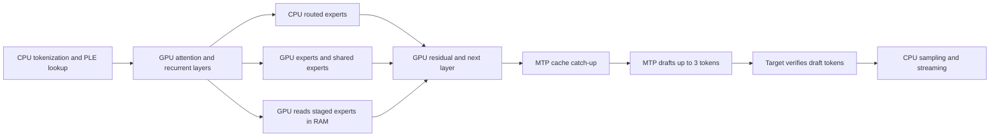

# Qwen Flash-Next memory map

Captured from the allocation-audited revised runtime. Context: 131,072 tokens. All weight rows come from the native tensor-to-buffer assignments, with exact payload bytes in ../evidence/tensor-placement.csv.

## GPU allocations at startup

| Component | MiB |
|---|---:|
| Target weightsMiB | 13670.52 |
| Target cacheMiB | 3456.00 |
| Target recurrentMiB | 562.85 |
| Target pooledIndexerMiB | 192.01 |
| Target computeMiB | 1216.61 |
| MTP weightsMiB | 1403.82 |
| MTP cacheMiB | 136.00 |
| MTP recurrentMiB | 0.00 |
| MTP pooledIndexerMiB | 0.00 |
| MTP computeMiB | 25.27 |
| Logged GPU allocation total | **20663.08** |

The card has 24,560 MiB. These allocations exclude desktop applications and driver overhead. They are allocations, not a guarantee that every byte is resident in physical VRAM.

Exact audited GPU buffer total: **21,666,809,348 bytes**, or **20663.08 MiB**. ../evidence/buffer-allocations.csv lists every logged model, cache, compute, and staged-expert buffer with its byte count.

Compute allocations can change as the actual graph changes. The additional live audit records these component peaks; their sum is not necessarily a simultaneous physical-residency peak.

| Live compute component | Peak MiB | Last MiB |
|---|---:|---:|
| Target Vulkan0 | 3500.79 | 3500.79 |
| Target Vulkan_Host | 1146.66 | 1146.66 |
| MTP Vulkan0 | 25.27 | 25.27 |
| MTP Vulkan_Host | 10.27 | 10.27 |

## Weight placement

| Model | Buffer | Component | Tensors | MiB |
|---|---|---|---:|---:|
| MTP | CPU_Mapped | Token embeddings | 1 | 341.02 |
| MTP | Vulkan0 | Routed expert banks | 3 | 1350.00 |
| MTP | Vulkan0 | Attention and indexer weights | 6 | 26.72 |
| MTP | Vulkan0 | MTP fusion | 7 | 10.63 |
| MTP | Vulkan0 | Hyperconnection mixers | 8 | 7.15 |
| MTP | Vulkan0 | Expert routers | 1 | 5.00 |
| MTP | Vulkan0 | Shared experts | 4 | 2.65 |
| MTP | Vulkan0 | Other dense weights | 4 | 1.66 |
| Target | CPU_Mapped | Routed expert banks | 120 | 39200.00 |
| Target | CPU_Mapped | PLE lookup table | 1 | 36621.27 |
| Target | CPU_Mapped | Token embeddings | 1 | 644.14 |
| Target | Vulkan0 | Routed expert banks | 24 | 9100.00 |
| Target | Vulkan0 | Attention and indexer weights | 144 | 2135.65 |
| Target | Vulkan0 | Hyperconnection mixers | 387 | 651.91 |
| Target | Vulkan0 | Output projection | 1 | 644.14 |
| Target | Vulkan0 | Recurrent layer weights | 252 | 588.37 |
| Target | Vulkan0 | Expert routers | 48 | 240.00 |
| Target | Vulkan0 | Shared experts | 192 | 239.53 |
| Target | Vulkan0 | Other dense weights | 54 | 70.91 |

CPU_Mapped identifies file-backed address ranges. The full PLE table is mapped, while Windows brings in its accessed pages. Mapped size must not be counted as fully resident RAM. GPU buffers contain uploaded weights; the source GGUF stays on disk.

## CPU and shared-memory allocations

| Component | MiB |
|---|---:|
| Target host compute workspace | 414.15 |
| MTP host compute workspace | 10.27 |
| Committed HostMoE staged expert copies | 3850.00 |
| Initial host output buffer | 0.95 per context |

Staged layers: 36, 37, 38, 39 (zero-based layer numbers). Vulkan reads these committed RAM copies over PCIe during prompt batches. They consume system RAM, not dedicated VRAM. CPU decode uses non-owning views of those same bytes on layers 36, 37, 38, 39. Original file mappings remain valid, but ordinary inference no longer reads their duplicate pages on these layers; Windows can reclaim those cold pages. No extra weight allocation is made for the CPU views.

Two prompt checkpoints also live in RAM. Their size grows with the draft prefix: the first revised run logged about 182 MiB per checkpoint at 64K. Tokenizer metadata, sampler arrays, exported hidden states, allocator bookkeeping, and driver-private allocations are not individually attributed by these native buffer records; OS working-set and commit counters cover the aggregate.

## Execution path

The target retains BF16 K/V, the BF16 selector cache, and FP32 recurrent states. MTP retains its own Q8 K/V. The revision shares the target's Q8 output projection instead of uploading the helper's separate Q6 projection. Target verification remains authoritative. Sharing the head changes draft numerics and requires live acceptance and speed validation.

This experiment enables bounded sparse attention for single-sequence prompt batches at 8K and above. Each query uses the same selected positions and causal visibility as the dense masked path. Groups of at most 64 queries gather their K/V rows, retaining BF16, and recycle the temporary workspace. The existing decode attention path remains selected. Arithmetic reduction order changes, so bit-identical generated text is not guaranteed. Independent GPU checks against a double-precision CPU attention oracle passed, including a 128K cache and BF16 values outside F16 range; this is a numerical check, not a general intelligence evaluation.

## Synthetic workload measurements

All runs allocate 131,072 context tokens. Each measured row appends approximately 4,096 fresh prompt tokens and generates 128 greedy tokens. Results depend on this synthetic workload and current machine state. Phase profiling is enabled for diagnostic runs.

| Loaded depth | Prompt tok/s | Decode tok/s | Exact reference tokens |
|---|---:|---:|---|
| 8,192 | 173.27 | 13.73 | No |
| 32,768 | 215.79 | 23.74 | Yes |
| 49,152 | 214.74 | 22.23 | Yes |
| 65,536 | 210.81 | 21.45 | Yes |
| 98,304 | 200.87 | 20.32 | No reference at this depth |
| 126,976 | 196.49 | 20.39 | No reference at this depth |

Run complete: true. The final measured prompt depth is 126,976 tokens (124K), with 131,072 capacity allocated.

## Comparison and next decision

The original runtime reserved 25,434.87 MiB on the GPU. Separating target and draft prompt batch sizes reduced that to 23,366.28 MiB, producing 118.90 prompt / 24.12 decode tok/s at 32K and 104.88 / 23.52 at 48K in the synthetic workload.

This revision uses a 1536-token prompt microbatch, skips the private 497.31 MiB draft output projection, reserves the KV-only MTP catch-up graph, and keeps 2 additional routed-expert layers on the CPU to create GPU headroom. It also shares staged expert storage between CPU decode and GPU prompt reads, reducing the need to keep duplicate source pages hot.
